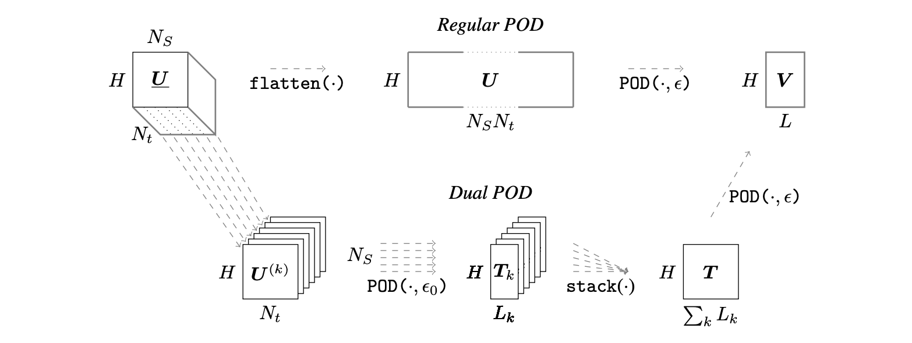
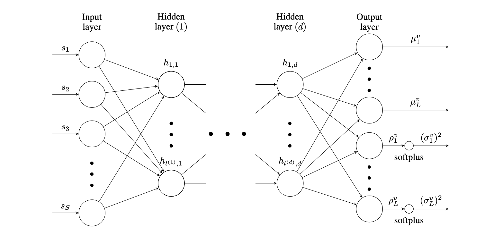
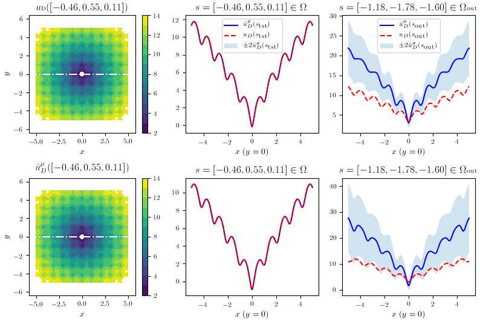
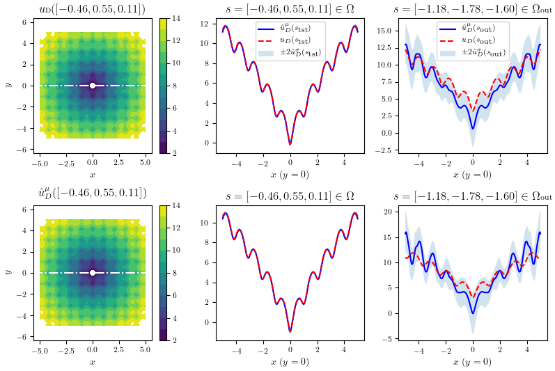

# Non-Intrusive Reduced-Order Modeling Using Uncertainty-Aware Deep Neural Networks and Proper Orthogonal Decomposition: Application to Flood Modeling
### Authors
[Pierre Jacquier](https://pierrejacquier.com), Azzedine Abdedou, Vincent Delmas, [Azzeddine Soulaïmani](https://www.etsmtl.ca/en/research/professors/asoulaimani/)

### Abstract
Deep Learning research is advancing at a fantastic rate, and there is
much to gain from transferring this knowledge to older fields like
Computational Fluid Dynamics in practical engineering contexts. This
work compares state-of-the-art methods that address uncertainty
quantification in Deep Neural Networks, pushing forward the
reduced-order modeling approach of Proper Orthogonal
Decomposition-Neural Networks (POD-NN) with Deep Ensembles and
Variational Inference-based Bayesian Neural Networks on two-dimensional
problems in space. These are first tested on benchmark problems, and
then applied to a real-life application: flooding predictions in the
Mille Îles river in the Montreal, Quebec, Canada metropolitan area. Our
setup involves a set of input parameters, with a potentially noisy
distribution, and accumulates the simulation data resulting from these
parameters. The goal is to build a non-intrusive surrogate model that is
able to know when it doesn’t know, which is still an open research area
in Neural Networks (and in AI in general). With the help of this model,
probabilistic flooding maps are generated, aware of the model
uncertainty. These insights on the unknown are also utilized for an
uncertainty propagation task, allowing for flooded area predictions that
are broader and safer than those made with a regular
uncertainty-uninformed surrogate model. Our study of the time-dependent
and highly nonlinear case of a dam break is also presented. Both the
ensembles and the Bayesian approach lead to reliable results for
multiple smooth physical solutions, providing the correct warning when
going out-of-distribution. However, the former, referred to as
POD-EnsNN, proved much easier to implement and showed greater
flexibility than the latter in the case of discontinuities, where
standard algorithms may oscillate or fail to converge.

* * * * * *

## Reduced Basis Generation with Proper Orthogonal Decomposition


We start by defining $u$, our $\mathbb{R}^{D}$-valued function of
interest. Computing this function is costly, so only a finite number $S$ of
solutions called *snapshots* can be realized. In our applications, the spatial mesh of $N_D$ nodes is considered fixed
in time, and since it is known and defined upfront, so we consider the number of outputs $H=N_D\times D$, the total number of degrees of freedom
(DOFs) of the mesh.
The simulation data, obtained from computing the function $u$ with $S$
parameter sets $\bm{s}^{(i)}$, is stored in a matrix of snapshots
$\bm{U} = [u_D(\bm{s}^{(1)})|\ldots|u_D(\bm{s}^{(S)})] \in \mathbb{R}^{H \times S}$.
Proper Orthogonal Decomposition (POD) is used to build a Reduced-Order
Model (ROM) and produce a *low-rank approximation*, which will be much
more efficient to compute and use when rapid multi-query simulations are
required. With the snapshots method, a
reduced POD basis can be efficiently extracted in a finite-dimension
context. In our case, we begin with the $\bm{U}$ matrix, and use the
Singular Value Decomposition algorithm, to extract
$\bm{W} \in \mathbb{R}^{H \times H}$,
$\bm{Z} \in \mathbb{R}^{S \times S}$ and the $r$ descending-ordered
positive singular values matrix
$\bm{D} = \text{diag}(\xi_1, \xi_2, \ldots, \xi_r)$ such that

\\[
\begin{aligned}
    \bm{U} = \bm{W} \begin{bmatrix} \bm{D} & 0 \\\\ 0 & 0 \end{bmatrix} \bm{Z}^\intercal.
   \end{aligned}
\\]

For the finite truncation of the first $L$ modes, the following
criterion on the singular values is imposed, with a hyperparameter
$\epsilon$ given as

\\[
    \dfrac{\sum_{l=L+1}^{r} \xi_l^2}{\sum_{l=1}^{r} \xi_l^2} \leq \epsilon,
\\]

and then each mode vector $\bm{V}_j \in \mathbb{R}^{S}$ can be found
from $\bm{U}$ and the $j$-th column of $\bm{Z}$, $\bm{Z}_j$, with

\\[
    \bm{V}_j = \dfrac{1}{\xi_j} \bm{U} \bm{Z}_j,
\\]
so that we can
finally construct our POD mode matrix

\\[
    \bm{V} = \left[\bm{V}_1 | \ldots | \bm{V}_j | \ldots | \bm{V}_L\right] \in \mathbb{R}^{H \times L}.
\\]
To project to and from the low-rank approximation requires projection
coefficients; those *corresponding* to the matrix of snapshots are
obtained by the following

\\[
    \bm{v} = \bm{V}^\intercal \bm{U},
\\]
and then $\bm{U}_\textrm{POD}$,
the approximation of $\bm{U}$, can be projected back to the expanded
space:

\\[
\bm{U}_\textrm{POD} = \bm{V}\bm{V}^\intercal\bm{U} = \bm{V} \bm{v}.
\\]

## POD-EnsNN: Learning Expansion Coefficients Distributions using Deep Ensembles



### Deep Neural Networks with built-in variance

This statistical step is handled in the POD-NN framework by inferring
the mapping with a Deep Neural Network,
$\hat{u}_{DB}(\bm{s};\bm{w},\bm{b})$. The *weights* and *biases* of the
network, $\bm{w}$ and $\bm{b}$, respectively, represent the model
parameters and are learned during training (*offline* phase), to be
later reused to make predictions (*online* phase). The network's number
of hidden layers is called the *depth*, $d$, which is chosen without
accounting for the input and output layers. Each layer has a specific
number of neurons that constitutes its *width*, $l^{(j)}$.

The main difference here with an ordinary DNN architecture for
regression resides in the dual output, where
the final layer size is twice the number of expansion coefficients to
project, $l^{(d+1)}=2L$, since it outputs both a *mean* value
$\bm{\mu}^v$ and a *raw variance* $\bm{\rho}^v$, which will then be
constrained for positiveness through a softplus function, finally
outputting ${\bm{\sigma^v}}^2$ as

\\[
    {\bm{\sigma}^v}^2 = \textrm{softplus}(\bm{\rho}^v) := \log(1 + \exp(\bm{\bm{\rho}^v})).
\\]

Since this predicted variance reports the spread, or noise, in data (the
inputs' data are drawn from a distribution), and so it would not be
reduced even if we were to grow our dataset larger, it accounts for the
*aleatoric uncertainty*, which is usually separated from *epistemic
uncertainty*.

### Ensemble training

Considering an $N$-sized training dataset
$\mathcal{D}=\{\bm{X}_i, \bm{v}_i\}$, with $\bm{X}_i$ denoting the
normalized non-spatial parameters $\bm{s}$, and $\bm{v}_i$ the
corresponding expansion coefficients from a training/validation-split of
the matrix of snapshots $\bm{U}$, an *optimizer* performs several
*training epochs* $N_e$ to minimize the following Negative
Log-Likelihood loss function with respect to the network weights and
biases parametrized by $\bm{\theta}=(\bm{w}, \bm{b})$

\\[
\begin{aligned} \mathcal{L}_{\textrm{NLL}}(\mathcal{D},\bm{\theta}):=\dfrac{1}{N} \sum{i=1}^{N}\left[\dfrac{\log\ \bm{\sigma}{\bm{\theta}}^v(\bm{X}_i)^2}{2}+ \dfrac{(\bm{v}_i-\bm{\mu}^v{\bm{\theta}}(\bm{X}i))^2}{2 \bm{\sigma}{\bm{\theta}}^v(\bm{X}_i)^2}\right], \end{aligned}
\\]

with the normalized inputs $\bm{X}$, $\bm{\mu}^v_{\bm{\theta}}(\bm{X})$
and $\bm{\sigma}_{\bm{\theta}}^v(\bm{X})^2$ as the mean and variance,
respectively, retrieved from the $\bm{\theta}$-parametrized network.

In practice, this loss gets an L2 regularization as an additional term, producing

\\[
\begin{aligned}
   \mathcal{L}^\lambda\_{\textrm{NLL}}(\mathcal{D}, \bm{\theta}):=\mathcal{L}_\textrm{NLL}(\mathcal{D}, \bm{\theta})+\lambda ||\bm{w}||^2.\end{aligned}
\\]

The idea behind Deep Ensembles is
to randomly initialize $M$ sets of $\bm{\theta}\_{m}=({\bm{w}},{\bm{b}})$,
thereby creating $M$ independent neural networks (NNs). Each NN is then
subsequently trained. Overall, the predictions moments in the reduced
space $(\bm{\mu}^v_{\bm{\theta}\_m},\bm{\sigma}^v_{\bm{\theta}\_m})$ of
each NN create a probability mixture, which, as suggested by the
original authors, we can approximate in a single Gaussian distribution,
leading to a mean expressed as

\\\[
\begin{aligned}
\bm{\mu}^v_*(\bm{X}) = \dfrac{1}{M} \sum_{m=1}^{M}\bm{\mu}^v_{\bm{\theta}_m}(\bm{X}),
   \end{aligned}
\\\]
and a variance subsequently obtained as

\\\[
\bm{\sigma}^v_\*(\bm{X})^2 = \dfrac{1}{M} \sum_{m=1}^{M} \left[\bm{\sigma}\_{\bm{\theta}\_m}^v(\bm{X})^2 + \bm{\mu}^v_{\bm{\theta}\_m}(\bm{X})^2\right] - \bm{\mu}_\*^v(\bm{X})^2.
\\\]

The model is now accounting for the *epistemic uncertainty* through
random initialization and variability in the training step. This
uncertainty is directly linked to the model and could be reduced if we
had more data. The uncertainty is directly related to the data-fitting
capabilities of the model and thus will snowball in the absence of such
data since there are no more constraints.

## POD-BNN: Bayesian Neural Networks and Variational Inference as an Alternative

For this model, the *epistemic uncertainty* treatment 
is very different. Earlier, even though the NNs were providing us with
a mean and variance, they were still deterministic, and variability was
obtained by assembling randomly initialized models. The Bayesian
treatment instead aims to assign distributions according to the
network's weights, and so they therefore have a probabilistic output by
design. 
Considering a dataset $\mathcal{D}=\{\bm{X}_i, \bm{v}_i\}$, a
*likelihood* function $p(\mathcal{D}|\bm{w})$ can be built, with
$\bm{w}$ denoting both the weights $\bm{w}$ and the biases $\bm{b}$ for
simplicity. The goal is then to construct a *posterior distribution*
$p(\bm{w}|\mathcal{D})$ to achieve the following *posterior predictive
distribution* on the target $\bm{v}$ for a new input $\bm{X}$

\\[
p(\bm{v}|\bm{X},\mathcal{D})=\int p(\bm{v}|\bm{X},\bm{w})p(\bm{w}|\mathcal{D})\,d\bm{w},
\\]

which cannot be achieved directly in a NN context, due to the infinite
possibilities for the weights $\bm{w}$, leaving the posterior
$p(\bm{w}|\mathcal{D})$ intractable.

Variational inference aims at construction an approximate posterior distribution $q(\bm{w}|\bm{\theta})$, by minimizing the KL divergence with the real posterior.
 In our case, it writes as
$\textrm{KL}(q(\bm{w}|\bm{\theta}),||p(\bm{w}|\mathcal{D}))$ with
respect to the new parameters $\bm{\theta}$ called *latent variables*,
such as

\\[
\begin{aligned}
\textrm{KL}(q(\bm{w} | \bm{\theta}) || p(\bm{w} | \mathcal{D})) &=
\int q(\bm{w} | \bm{\theta}) \log 
    \dfrac{q(\bm{w} | \bm{\theta})}{p(\bm{w}|\mathcal{D})}\, d\bm{w}=\mathbb{E}_{q(\bm{w} | \bm{\theta})}\log 
    \dfrac{q(\bm{w} | \bm{\theta})}{p(\bm{w}|\mathcal{D})},\end{aligned}
\\]
which can be show to written as 

\\\[
 \begin{aligned}
  \textrm{KL}(q(\bm{w} | \bm{\theta}) || p(\bm{w} | \mathcal{D}))
    &=\textrm{KL}(q(\bm{w}|\bm{\theta})||p(\bm{w})) - \mathbb{E}\_{q(\bm{w} | \bm{\theta})} \log p(\mathcal{D}|\bm{w}) + \log p(\mathcal{D})\\\\ &=:\mathcal{F}(\mathcal{D},\bm{\theta}) + \log p(\mathcal{D})
\end{aligned}
\\\]

The term $\mathcal{F}(\mathcal{D}, \bm{\theta})$ is commonly known as
the *variational free energy*, and minimizing it with respect to the
weights does not involve the last term $\log p(\mathcal{D})$, and so it
is equivalent to the goal of minimizing
$\textrm{KL}(q(\bm{w}|\bm{\theta}),||p(\bm{w}|\mathcal{D}))$. If an
appropriate choice of $q$ is made, the predictive posterior can
become computationally tractable.

By drawing $N_\textrm{mc}$ samples $\bm{w}^{(i)}$ from the distribution
$q(\bm{w}|\bm{\theta})$ at the layer level, it is possible to construct
a tractable Monte-Carlo approximation of the variational free energy,
such as

\\[
\mathcal{F}(\mathcal{D},\bm{\theta}) \approx
\sum_{i=1}^{N_\textrm{mc}} \left[
\log q(\bm{w}^{(i)} | \bm{\theta}) -
\log p(\bm{w}^{(i)})\right] -
\sum_{m=1}^{N}
\log p(\mathcal{D} | \bm{w}_m),
\\]
with $p(\bm{w}^{(i)})$ denoting the *prior* on the drawn weight
$\bm{w}^{(i)}$, which is chosen by the user. The last term shows to be
approximated by summing on the $N$ samples at the output level (for each
training input).

## A Few Results
### Benchmark: 2D Ackley Function
**POD-EnsNN**

**POD-BNN**


### Shallow Water equations validation: 1D dam break
...

### Rendering training data from CuteFlow, our numerical solver
[](https://www.youtube.com/watch?v=LNr0EwB-PJU)


* * * * * 

**Acknowledgements**

This research was enabled in part by funding from the National Sciences
and Engineering Research Council of Canada and Hydro-Québec; by bathymetry data from the
[Communauté métropolitaine de Montréal](https://cmm.qc.ca/); and by
computational support from [Calcul Québec](www.calculquebec.ca) and
[Compute Canada](www.computecanada.ca).

* * * * *

### Citation
```
@misc{jacquier2020nonintrusive,
    title={Non-Intrusive Reduced-Order Modeling Using Uncertainty-Aware Deep Neural Networks and Proper Orthogonal Decomposition: Application to Flood Modeling},
    author={Pierre Jacquier and Azzedine Abdedou and Vincent Delmas and Azzeddine Soulaimani},
    year={2020},
    eprint={2005.13506},
    archivePrefix={arXiv},
    primaryClass={physics.comp-ph}
}
```
